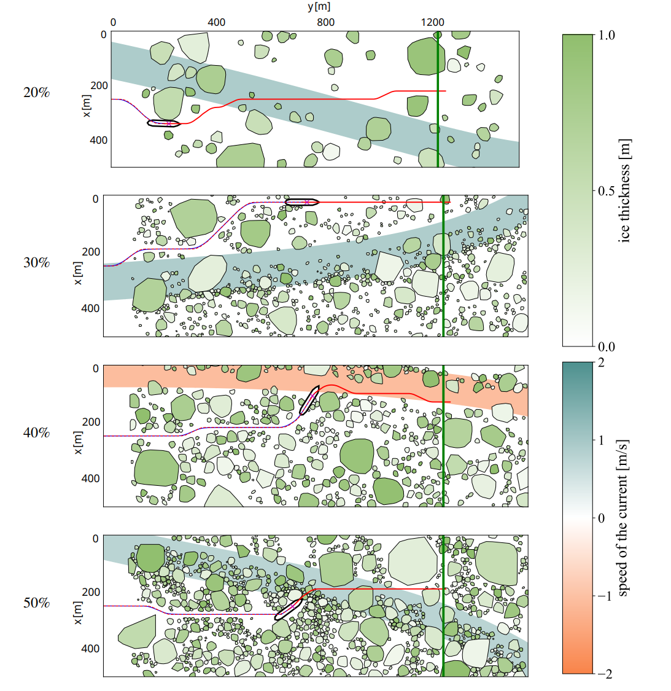

# Tactical Navigation Support System for Dynamic Ice Floe Fields

Code for the paper "Tactical navigation support system for dynamic ice floe fields".

## Overview

This repository contains:

- A ROS2-based ship navigation simulator and planner for dynamic ice fields.
- Dataset generation and preprocessing pipelines.
- Deep learning training and evaluation code.
- Trained neural network weights.

The simulator is based on [AUTO-IceNav](https://github.com/rdesc/AUTO-IceNav) and [Predictive](https://github.com/IvanIZ/predictive-asv-planner), a 2D physics simulator for ship-ice interactions built with [Pymunk](https://www.pymunk.org/en/latest/).

Sample paths generated by our planner in four different concentrations:




## Installation

### 1. Python dependencies

Create and activate a Python environment, then install dependencies from `requirements.txt`:

```bash
python -m venv .venv
source .venv/bin/activate
pip install --upgrade pip
pip install -r requirements.txt
```

### 2. ROS installation

This project requires ROS (Robot Operating System). Install ROS first: [ROS (Robot Operating System)](https://docs.ros.org/en/humble/Installation.html).

### 3. Install custom ROS packages

Custom ROS packages used in this project are included in `custom_ros2_pkg/` and must be installed/built within your ROS2 workspace ([ROS package guide](https://docs.ros.org/en/foxy/Tutorials/Beginner-Client-Libraries/Creating-Your-First-ROS2-Package.html)).

Typical ROS2 workspace setup:

```bash
mkdir -p ~/ros2_ws/src
cp -r custom_ros2_pkg/custom_msgs ~/ros2_ws/src/
cd ~/ros2_ws
colcon build
source install/setup.bash
```

## Usage

The workflow is typically run in this order:

1. Generate ice field environments.
2. Generate navigation dataset using the random planner.
3. Preprocess extracted data.
4. Train and test network stages (`map`, `cls`, `reg`).
5. Run the trained planner in simulation.

Before running planner/simulator nodes, make sure ROS2 is sourced in each shell:

```bash
source /path/to/your/ros2_ws/install/setup.bash
```

### 1. Ice field generation

Generate experiment files for one or more concentrations:

```bash
python -u -m submodules.src.environment.generate_exp \
	--conc 20 \
	--file_name ice_environments/trials/20/experiments_20_t0-100.pkl \
	--trial_range 0 100
```

Notes:

- `--conc` accepts one or more values from `20 30 40 50`.
- Output is a pickled environment file used by the simulator.

### 2. Data generation (random planner)

Run the simulator and random planner together to collect trials.

Terminal A (simulator):

```bash
python -u asv_navigation.py \
	--cfg configs/data_collection_config.yaml \
	--env ice_environments/trials/20/experiments_20_t0-100.pkl \
	--dir data/trials \
	--conc 20 \
	--trial_range 0 100 \
	--id 1
```

Terminal B (random planner):

```bash
python -u -m planners.random \
	--cfg configs/data_collection_config.yaml \
	--trial_range 0 100 \
	--conc 20 \
	--id 1
```

Notes:

- Each simulator/planner pair should have a unique `id` so the communications wouldn't be intercepted when running multiple instances in parallel (e.g., running on HPCs)

### 3. Data preprocessing

Preprocess raw trial data into model-ready tensors:

```bash
python -u data_preprocess.py \
	--data_dir ./data/trials \
	--save_dir ./data/processed/h80w80/20 \
	--trial_range 0 5000 \
	--chunksize 25 \
	--conc 20 \
	-wh 80 -ww 80
```

### 4. Train and test the network

Training is done in three stages: `map`, `cls`, `reg`.

#### Train stage: `map`

```bash
python -u train.py \
	--data_dir ./data/processed/h80w80/ \
	--arch unet \
	-b 512 -c 25 -nc 1 \
	-e 50 --lr 0.001 -wd 0 \
	--cpus 8 --gpus 1 --nodes 1 \
	--valfreq 5 \
	--conc 20 30 40 50 \
	--train_trial_range 0 8000 \
	--val_trial_range 8000 9000 \
	--test_trial_range 9000 10000 \
	-wh 80 -ww 80 \
	--main_loss_fn mse \
	--cls_loss_fn bce \
	--reg_loss_fn mse \
	--in_channels 6 --out_channels 4 \
	--stage map
```

For `cls` and `reg` stages, rerun training with `--stage cls` or `--stage reg` (and any stage-specific checkpoint/resume options you use).

#### Test a trained checkpoint

```bash
python -u test.py \
	--data_dir ./data/processed/h80w80/v2 \
	-b 512 -c 25 -nc 1 \
	--cpus 8 --gpus 1 \
	--conc 20 30 40 50 \
	--test_trial_range 9000 10000 \
	--in_channels 6 --out_channels 4 \
	--stage reg \
	--cost_log \
	--ckpt_path <checkpoints_path>.ckpt
```

Notes:

- `map` stage needs to be trained first so the model learns the representation of ice field patterns. `cls` and `reg` stages could be trained in parallel, since they both use the learned embeddings from the network bottleneck.
- `cost_log` option uses the logarithm of the cost value to train the regression stage, which is more stable and leads to better convergence.

### 5. Run trained planner (inference/simulation)

Run the simulation node and a trained planner node in parallel, for example with `icenet` (ours).

Terminal A (simulator):

```bash
python -u asv_navigation.py \
	--cfg configs/icenet_config.yaml \
	--env ice_environments/v2/30/experiments_30_t9900-10000.pkl \
	--dir outputs/v2/icenet/30 \
	--conc 30 \
	--trial_range 9900 10000 \
	--id 1
```

Terminal B (trained planner):

```bash
python -u -m planners.icenet \
	--cfg configs/icenet_config.yaml \
	--trial_range 9900 10000 \
	--conc 30 \
	--id 1
```

Use the corresponding config and planner module for other planners (for example `predictive`, `lattice`, or `straight`).

## Notes

- `train.py` uses Weights & Biases logging and expects `configs/wandb.yaml` with a valid API key.
- Ensure ROS message interfaces from `custom_ros2_pkg/custom_msgs` are built and sourced before planner/simulator execution.
- If running on HPC/containers, keep command arguments the same and adapt only the job launcher/container wrapper.

